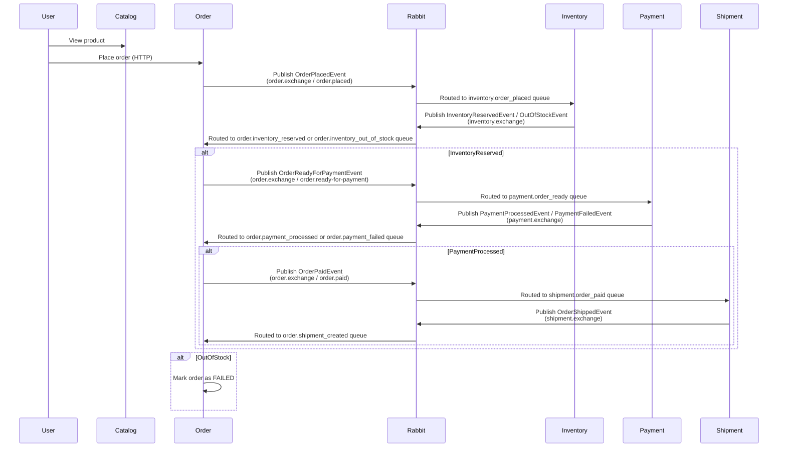

# 🛒 Distributed Online Store (Spring Boot + RabbitMQ + OpenTelemetry)

This is a demo project that showcases a **microservices-based online store** built using **Spring Boot**, **RabbitMQ**, and **OpenTelemetry** for distributed tracing with **Jaeger**.

---

## 📦 Architecture Overview

This project is composed of 5 independent microservices:

| Service            | Description                                      |
|--------------------|--------------------------------------------------|
| `catalog-service`  | Manages product catalog (name, price)            |
| `order-service`    | Accepts orders and tracks status                 |
| `inventory-service`| Reserves product stock on order                  |
| `payment-service`  | Simulates payment processing                     |
| `shipment-service` | Simulates shipment creation                      |

All services communicate asynchronously using **RabbitMQ** with topic exchanges and routing keys. Traces are collected and visualized in **Jaeger**, via **OpenTelemetry OTLP over gRPC**.

---

## 🧭 Message Flow

The order workflow looks like this:



All messages are defined using clean, structured DTOs, and published via Spring’s `RabbitTemplate`. Tracing headers are propagated automatically through RabbitMQ using OpenTelemetry and Micrometer.

---

## 📡 Messaging Overview

| Message                   | Sent By          | Consumed By         |
|---------------------------|------------------|----------------------|
| `OrderPlacedEvent`        | order-service     | inventory, payment   |
| `InventoryReservedEvent`  | inventory-service | order-service        |
| `InventoryOutOfStockEvent`| inventory-service | order-service        |
| `PaymentProcessedEvent`   | payment-service   | order-service        |
| `PaymentFailedEvent`      | payment-service   | order-service        |
| `OrderShippedEvent`       | shipment-service  | order-service        |

---

## 🕵️ Distributed Tracing

This project uses:

- [OpenTelemetry Java Agent](https://github.com/open-telemetry/opentelemetry-java-instrumentation)
- [Jaeger](https://www.jaegertracing.io/) as the trace backend
- OTLP over gRPC (`4317`) for trace export
- Micrometer Tracing via Spring Boot 3

Trace data includes:
- All HTTP requests
- All RabbitMQ messages (send and receive)
- Correlated spans across services

Access the Jaeger UI at: [http://localhost:16686](http://localhost:16686)

---

## 🚀 Getting Started

### 🐳 Requirements

- Java 17+
- Docker + Docker Compose
- Maven

### 📁 Clone the Repo

```bash
git clone https://github.com/yourname/online-store-microservices.git
cd online-store-microservices
```

### 🧰 Start Infrastructure

```bash
docker compose up -d
```

This starts:
- 🐇 RabbitMQ (internal)
- 📈 Jaeger UI (on `http://localhost:16686`)

> **Note:** Only Jaeger is exposed to the host. RabbitMQ is used internally.

---

### 🛠 Run Services with Tracing

Each service can be run like this:

```bash
java \
  -javaagent:opentelemetry-javaagent.jar \
  -Dotel.service.name=order-service \
  -Dotel.exporter.otlp.endpoint=http://localhost:4317 \
  -Dotel.exporter.otlp.protocol=grpc \
  -Dotel.logs.exporter=none \
  -jar order-service/target/order-service.jar
```

Change the service name and JAR path per service.

---

## 🧪 Try the Flow

1. Start all services with the agent
2. Use Postman or a browser to call the catalog and order endpoints
3. Watch traces appear in Jaeger

---

## 🧱 Project Structure

```
.
├── catalog-service/
├── order-service/
├── inventory-service/
├── payment-service/
├── shipment-service/
├── common/                  # Shared DTOs and constants
├── docker-compose.yml       # Jaeger setup
└── otel-javaagent.jar       # OpenTelemetry agent
```

---

## 📋 Notes

- No database persistence for simplicity — uses in-memory data stores.
- No authentication or customer service to keep services focused and isolated.
- Each service is decoupled and communicates through events only.
- DTOs and messaging topics are shared via the `common` module.

---

## 📖 Learn More

- [OpenTelemetry for Java](https://opentelemetry.io/docs/instrumentation/java/)
- [Jaeger Tracing](https://www.jaegertracing.io/)
- [Micrometer Tracing](https://micrometer.io/docs/tracing)
- [Spring AMQP](https://spring.io/projects/spring-amqp)

---

## 📣 Contributions Welcome

If you'd like to extend this with more realistic features (Postgres, Eureka, API Gateway, Prometheus), feel free to fork and contribute!

---

## 📝 License

MIT 